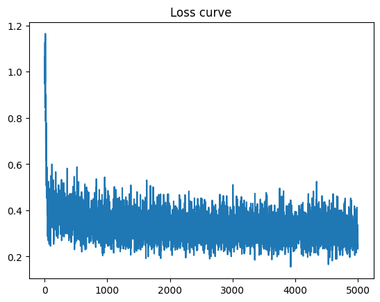
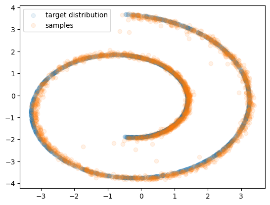

# Denoising Diffusion Probabilistic Models (DDPM)

<p align="center">
  
</p>

This repository demonstrates the implementation of **Denoising Diffusion Probabilistic Models (DDPM)**, a key technique behind many modern diffusion-based generative models. It offers both a 2D “Swiss Roll” example and a 64×64 image generation pipeline using the [AFHQ dataset](https://arxiv.org/abs/2003.07055).

> **Note**: Much of this code is adapted from materials originally developed by **Minhyuk Sung** (KAIST), **Seungwoo Yoo** (KAIST), and other contributors to the KAIST CS492(D) course. This project is intended for learning and experimentation. Please see the [Credits](#credits) section for full acknowledgments.

---

## Overview

### 1. DDPM Recap

DDPM is a latent-variable generative model in which data is gradually noised through a forward process, transforming a sample 
$\mathbf{x}_0$ from the real data distribution into a Gaussian noise $\mathbf{x}_T.$ 
A trained *reverse* (or *denoising*) process then recovers a clean sample from the noise, step by step:

- **Forward Process**  
  q_phi(x_t | x_{t-1}) = N(x_t | sqrt(1 - beta_t) * x_{t-1}, beta_t * I)

- **Reverse Process**  
  p_theta(x_{t-1} | x_t) = N(x_{t-1} | mu_theta(x_t, t), Sigma_theta(x_t, t))


- **Objective**  
  Learn the reverse noising steps by predicting the injected noise and minimizing a simple $\ell_2$ objective.  

For a thorough explanation, refer to the [DDPM paper](https://arxiv.org/abs/2006.11239) and Lilian Weng’s [blog post](https://lilianweng.github.io/posts/2021-07-11-diffusion-models/).

### 2. Repository Structure

```
.
├── 2d_plot_diffusion_todo
│   ├── ddpm_tutorial.ipynb    <--- Notebook demonstrating a 2D (Swiss Roll) diffusion experiment
│   ├── dataset.py             <--- Defines 2D toy datasets
│   ├── network.py             <--- Noise prediction network for 2D example
│   └── ddpm.py                <--- DDPM pipeline for 2D example
│
└── image_diffusion_todo
    ├── dataset.py             <--- AFHQ dataset utilities
    ├── model.py               <--- Diffusion model (U-Net + Scheduler)
    ├── module.py              <--- Basic modules used in U-Net
    ├── network.py             <--- U-Net architecture
    ├── sampling.py            <--- Code for sampling images from the trained model
    ├── scheduler.py           <--- Forward/reverse diffusion steps
    ├── train.py               <--- Training script
    └── fid
        ├── measure_fid.py     <--- FID evaluation script
        └── afhq_inception.ckpt <--- Pre-trained classifier for FID
```

---

## Getting Started

### 1. Installation

**Conda environment (recommended)**:

```bash
conda create --name ddpm python=3.10
conda activate ddpm
conda install pytorch==1.12.1 torchvision==0.13.1 torchaudio==0.12.1 cudatoolkit=11.3 -c pytorch
```

**Install required Python packages**:

```bash
pip install -r requirements.txt
```

> **Note**: The dependency on `chamferdist` is removed to avoid installation issues.

### 2. Running the 2D Example

Inside the `2d_plot_diffusion_todo` folder:

1. Open `ddpm_tutorial.ipynb` (e.g., with Jupyter Notebook).
2. Run the cells to:
   - Train a DDPM on a 2D dataset (e.g., Swiss Roll).
   - Visualize the forward process, reverse sampling, and final samples.
   - Evaluate the Chamfer Distance between generated samples and the ground truth distribution.

**Sample Results** might look like:

<p align="center">
   
  
</p>

### 3. Image Generation with AFHQ

In `image_diffusion_todo`, we train and sample from a 64×64 DDPM on [AFHQ (Animals)](https://arxiv.org/abs/2003.07055).

1. **Train**:
   ```bash
   python train.py
   ```
   - Automatically logs intermediate samples and saves checkpoints.

2. **Sampling**:
   ```bash
   python sampling.py --ckpt_path <CHECKPOINT_PATH> --save_dir <OUTPUT_DIR>
   ```
   - Generates and saves sample images in `<OUTPUT_DIR>`.

3. **Evaluate FID** (using a pre-trained Inception network):
   ```bash
   # Create evaluation directory (one-time setup):
   python dataset.py

   # Compute FID between real images and your generated images:
   python fid/measure_fid.py <AFHQ_VALIDATION_DIR> <OUTPUT_DIR>
   ```
   > Make sure `<AFHQ_VALIDATION_DIR>` points to valid AFHQ validation images (e.g., `data/afhq/eval`).

Sample generated results and their measured FID:

<p align="center">
  
</p>

---

## Implementation Details

The main logic is straightforward:

## Implementation Details

The main logic is straightforward:

1. **Forward Process**

A noisy sample can be written as:
$$
\mathbf{x}_t \;=\; \sqrt{\bar{\alpha}_t}\,\mathbf{x}_0 \;+\; \sqrt{1 - \bar{\alpha}_t}\,\boldsymbol{\epsilon},
$$
where $\boldsymbol{\epsilon} \sim \mathcal{N}(\mathbf{0}, \mathbf{I}).$

2. **Reverse Process** (single step)

$$
\mathbf{x}_{t-1} \;\sim\; p_{\theta}(\mathbf{x}_{t-1} \mid \mathbf{x}_t),
$$
with
$$
p_{\theta}(\mathbf{x}_{t-1} \mid \mathbf{x}_t) \;=\;
\mathcal{N}\!\Bigl(
    \mathbf{x}_{t-1} \,\Big|\,
    \boldsymbol{\mu}_{\theta}(\mathbf{x}_t, t),\;
    \boldsymbol{\Sigma}_{\theta}(\mathbf{x}_t, t)
\Bigr).
$$

3. **Training Loss**

The network is trained to predict the noise $\boldsymbol{\epsilon}$ directly, yielding:
$$
\mathcal{L}_{\mathrm{simple}}
\;=\;
\mathbb{E}_{t,\,\mathbf{x}_0,\,\boldsymbol{\epsilon}}
\Bigl[
    \bigl\|
        \boldsymbol{\epsilon} \;-\; \boldsymbol{\epsilon}_{\theta}(\mathbf{x}_t, t)
    \bigr\|^2
\Bigr].
$$


You can find the relevant functions and classes in:
- **2D Example**: `ddpm.py` and `network.py` (for the noise-prediction MLP).  
- **Image Generation**: `scheduler.py`, `model.py`, and `network.py` (the U-Net).

---

## Further Resources

- [**Denoising Diffusion Probabilistic Models** (Ho et al.)](https://arxiv.org/abs/2006.11239)  
- [**Denoising Diffusion Implicit Models** (Song et al.)](https://arxiv.org/abs/2010.02502)  
- [**Diffusion Models Beat GANs on Image Synthesis** (Dhariwal & Nichol)](https://arxiv.org/abs/2105.05233)  
- [**Score-Based Generative Modeling** (Song et al.)](https://arxiv.org/abs/2011.13456)  
- [**What are Diffusion Models?** (Lilian Weng)](https://lilianweng.github.io/posts/2021-07-11-diffusion-models/)  
- [**Generative Modeling by Estimating Gradients of the Data Distribution** (Yang Song)](https://yang-song.net/blog/2021/score/)

---

## Credits

- **Original Course Contributors**:
  - [Minhyuk Sung](https://mhsung.github.io/) (KAIST)
  - [Seungwoo Yoo](https://dvelopery0115.github.io/) (KAIST)
  - [Juil Koo](https://63days.github.io/) (KAIST)
  - [Nguyen Minh Hieu](https://hieuristics.xyz/) (KAIST)

This project is adapted from materials of **KAIST CS492(D): Diffusion Models and Their Applications (Fall 2024)**. Special thanks to the course instructor and TAs for their excellent materials and guidance.

If you use or modify this code, please retain this acknowledgment and the references to the original authors and sources.
